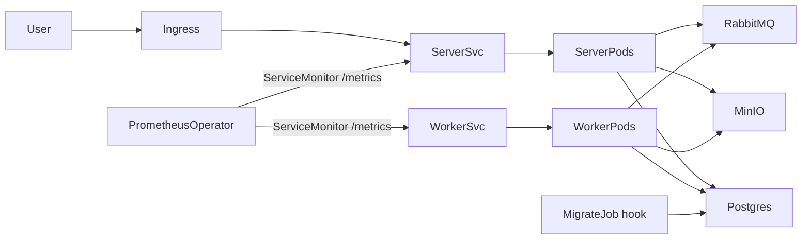

# GophProfile

Микросервис управления аватарками пользователей.

Стек: **Go**, **Chi**, **PostgreSQL**, **MinIO**, **RabbitMQ**, **golang-migrate**, Docker Compose, **Helm / Kubernetes**. Наблюдаемость: **OpenTelemetry**, **Prometheus**, **Jaeger**, **Grafana Loki**.

## Структура

```
cmd/server/              # HTTP API
cmd/worker/              # асинхронная обработка изображений
cmd/migrate/             # применение SQL-миграций
cmd/check/               # проверка Postgres / MinIO / RabbitMQ
internal/config/         # конфигурация из env
internal/infra/          # клиенты инфраструктуры
internal/observability/  # трейсы, метрики, slog
migrations/              # SQL-миграции (golang-migrate)
web/                     # веб-интерфейс
docs/openapi.yaml        # OpenAPI 3 спецификация HTTP API
deploy/observability/    # Prometheus, Loki, Grafana, Alertmanager (Compose)
deploy/helm/gophprofile/ # Helm chart (server, worker, HPA, Ingress, NetworkPolicy)
deploy/k8s/              # namespace + демо-инфра для kind/minikube
```

## Архитектура



- **server** — HTTP API и веб-UI, порт `8080`. Пробы: `GET /livez` (процесс жив), `GET /readyz` и `GET /health` (Postgres, MinIO, RabbitMQ). Метрики: `GET /metrics`.
- **worker** — обработка очередей миниатюр и удаления. Метрики и пробы на `:9091` (`/metrics`, `/livez`, `/readyz`).
- **migrate** — Helm `pre-install`/`pre-upgrade` Job (`./migrate -direction=up`).
- Postgres, MinIO и RabbitMQ в чарт не входят: внешние сервисы (в kind — манифесты `deploy/k8s/infra`).

## Быстрый старт (Docker)

Одной командой поднимаются Postgres, MinIO, RabbitMQ, migrate, server и worker:

```bash
docker compose up -d --build
# или
task up
```

С наблюдаемостью (Jaeger, Prometheus, Loki, Grafana, Alertmanager):

```bash
docker compose --profile obs up -d --build
# или
task up:obs
```

Проверка:

```bash
curl http://localhost:8080/livez
curl http://localhost:8080/readyz
curl http://localhost:8080/health
curl http://localhost:8080/web/upload
curl http://localhost:8080/metrics
```

Остановка: `task down` · логи: `task logs` · логи obs: `task logs:obs`

### Локальный запуск без контейнеров приложения

```bash
cp .env.example .env
task deps
task up:infra      # только Postgres/MinIO/RabbitMQ
task migrate
task run-server    # терминал 1
task run-worker    # терминал 2
```

Список задач: `task --list`.

Веб-интерфейс:
- Upload: http://localhost:8080/web/upload
- Gallery: http://localhost:8080/web/gallery/demo-user

### UI сервисов

| Сервис | URL | Доступ |
|--------|-----|--------|
| API / Web | http://localhost:8080 | |
| Grafana | http://localhost:3000 | `admin` / `admin` |
| Jaeger | http://localhost:16686 | |
| Prometheus | http://localhost:9090 | |
| Alertmanager | http://localhost:9093 | |
| Loki | http://localhost:3100 | |
| MinIO Console | http://localhost:9001 | `minioadmin` / `minioadmin` |
| RabbitMQ Management | http://localhost:15672 | `guest` / `guest` |

Grafana datasources (Prometheus, Loki, Jaeger) поднимаются автоматически. Дашборд **GophProfile / Service overview**: RED, resources, business KPIs, worker, error logs. С лога по `trace_id` — переход в Jaeger (кнопка **Explore Jaeger** на дашборде). Loki Explore: `{service="gophprofile-server"} | json | trace_id="<id>"`.

### API

```bash
# health
curl http://localhost:8080/health

# upload
curl -X POST http://localhost:8080/api/v1/avatars \
  -H "X-User-ID: user-1" \
  -F "file=@./photo.jpg;type=image/jpeg"

# get / metadata / list / delete
curl http://localhost:8080/api/v1/avatars/{id} --output avatar.jpg
curl "http://localhost:8080/api/v1/avatars/{id}?size=100x100" --output thumb.jpg
curl http://localhost:8080/api/v1/avatars/{id}/metadata
curl http://localhost:8080/api/v1/users/user-1/avatars
curl -X DELETE http://localhost:8080/api/v1/avatars/{id} -H "X-User-ID: user-1"
```

OpenAPI 3: [docs/openapi.yaml](docs/openapi.yaml).

Worker (миниатюры и удаление из S3):

```bash
task run-worker
```

## Конфигурация

Все параметры задаются через переменные окружения. См. [`.env.example`](.env.example).

| Группа        | Примеры переменных                                      |
|---------------|---------------------------------------------------------|
| HTTP          | `HTTP_ADDR`, `HTTP_READ_TIMEOUT`                        |
| DB            | `DB_HOST`, `DB_PORT`, `DB_USER`, `DB_PASSWORD`, `DB_NAME` |
| MinIO         | `S3_ENDPOINT`, `S3_ACCESS_KEY`, `S3_SECRET_KEY`, `S3_BUCKET` |
| RabbitMQ      | `RABBITMQ_URL`, `RABBITMQ_EXCHANGE`                     |
| Upload        | `UPLOAD_MAX_SIZE_BYTES` (по умолчанию 10MB)             |
| Observability | `OTEL_ENABLED`, `OTEL_SERVICE_NAME`, `OTEL_EXPORTER_OTLP_ENDPOINT`, `LOG_LEVEL`, `METRICS_PATH`, `METRICS_ADDR` |

Для локального запуска приложения на хосте при поднятом `task up:obs` используйте `OTEL_EXPORTER_OTLP_ENDPOINT=localhost:4317` (уже в `.env.example`).

## Зафиксированный стек

- HTTP: [go-chi/chi](https://github.com/go-chi/chi)
- Object storage: [minio-go](https://github.com/minio/minio-go)
- Broker: [amqp091-go](https://github.com/rabbitmq/amqp091-go) (RabbitMQ)
- Migrations: [golang-migrate](https://github.com/golang-migrate/migrate)
- Tracing: OpenTelemetry → OTLP → Jaeger
- Metrics: Prometheus (`/metrics` на server `:8080` и worker `:9091`)
- Logs: slog JSON → Promtail → Loki

## Kubernetes

Чарт: [deploy/helm/gophprofile](deploy/helm/gophprofile). Сырые манифесты для ревью: `task helm:template`.

### Зависимости кластера

- Ingress controller (например ingress-nginx)
- metrics-server — для HPA по CPU/RAM
- Prometheus Operator — если нужен `ServiceMonitor` (`values-prod.yaml` включает его)
- Образ приложения должен быть доступен в кластере

### Kind / minikube (демо)

Инфра вынесена в отдельный namespace `gophprofile-infra` (PSS `baseline`), приложение — в `gophprofile` (PSS `restricted`).

```bash
docker build -t gophprofile:latest .
# kind:  kind load docker-image gophprofile:latest
# minikube: minikube image load gophprofile:latest

kubectl apply -f deploy/k8s/namespace.yaml
kubectl apply -n gophprofile-infra -f deploy/k8s/infra/
kubectl -n gophprofile-infra wait --for=condition=available deploy/postgres deploy/minio deploy/rabbitmq --timeout=120s

helm upgrade --install gophprofile deploy/helm/gophprofile \
  -n gophprofile \
  -f deploy/helm/gophprofile/values-dev.yaml
```

Проверка:

```bash
kubectl -n gophprofile port-forward svc/gophprofile-server 8080:80
curl http://127.0.0.1:8080/livez
curl http://127.0.0.1:8080/readyz
```

Секреты в git не хранятся. Для production-установки скопируйте [secrets.example.yaml](deploy/helm/gophprofile/secrets.example.yaml) в `secrets.yaml` (файл в `.gitignore`) или создайте Secret заранее и укажите `existingSecret`.

```bash
helm upgrade --install gophprofile deploy/helm/gophprofile \
  -n gophprofile \
  -f deploy/helm/gophprofile/values-prod.yaml \
  -f secrets.yaml
```

Рендер и lint без кластера: `task helm:lint` · `task helm:template`.

### Что создаёт чарт

- Deployment + Service: **server** (`http` + `metrics` на 8080) и **worker** (`metrics` на 9091)
- Ingress с `proxy-body-size: 10m`
- ConfigMap (несекретный env) и Secret (`DB_PASSWORD`, S3 keys, `RABBITMQ_URL`)
- HPA v2 по CPU 70% и memory 80% (`values-prod`)
- ServiceMonitor на порт `metrics`, `/metrics` каждые 30s
- NetworkPolicy: default-deny, Ingress от ingress-nginx, scrape от Prometheus, egress на DNS / Postgres / MinIO / RabbitMQ / OTLP
- ServiceAccount без RoleBinding (приложению kube-api не нужен), `automountServiceAccountToken: false`
- SecurityContext: non-root uid `10001`, `readOnlyRootFilesystem`, drop ALL capabilities, RuntimeDefault seccomp
- Job-хук миграций БД

Graceful shutdown: `preStop` sleep 5s, затем SIGTERM; server вызывает `http.Server.Shutdown` (до 20s), worker отменяет consume. `terminationGracePeriodSeconds: 30`.

## Тесты и качество

```bash
task test          # все тесты
task cover         # ./internal/... и порог покрытия >= 50%
task lint:install  # один раз установить golangci-lint
task lint          # статический анализ

# интеграционные тесты репозитория/S3 требуют поднятой infra:
task up
go test ./internal/repository/... -count=1 -v
```
